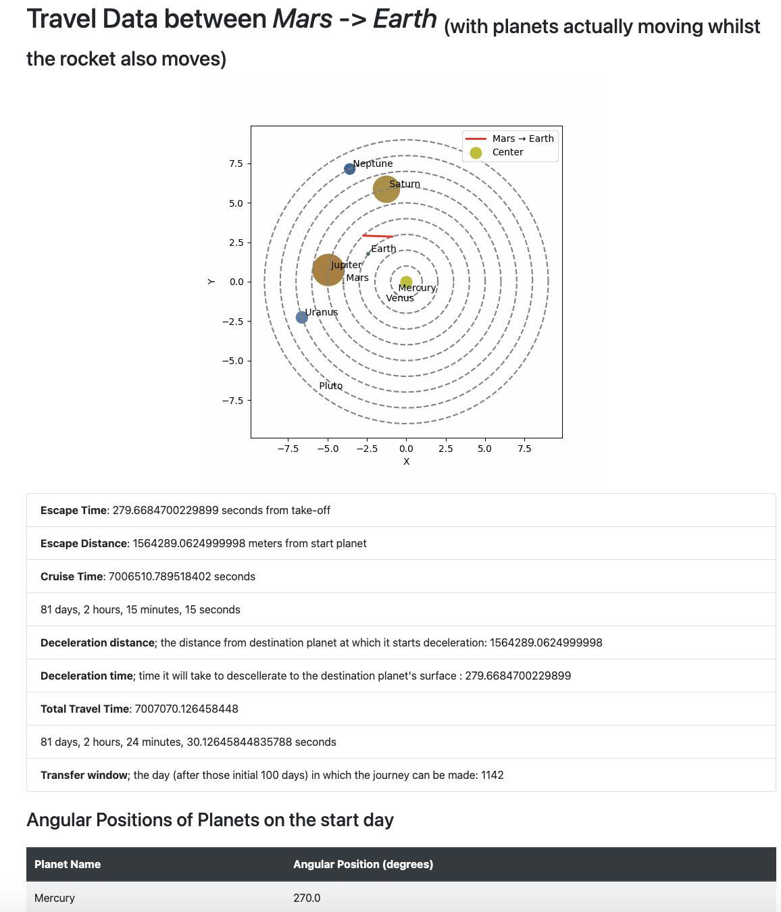

### 🚀STRATEC ROCKET CHALLENGE🚀

<b>ok, this was amazing</b> , so cosidering I didn't make it 'till Monday I wanted to go a little extra (astronomical) mile, feeling I had to

https://github.com/user-attachments/assets/030b042d-d07e-422c-8a37-3a980be9e88e


#### running it:
```bash
#yes, twice
cd soft_challange/soft_challange
```

so `pwd` returns somehting like `/path/to/soft_challange/soft_challange`
then

```bash
pip install -r requirements.txt
flask --app . run
```
and now you can access the app through your localhost or 127.000 or whatever


<br>
<br>


In the homepage you can drag and drop files for each stage of the problem (don't judge okay, I know it looks goofy)


<br>

##### The simplest way to use it is to just upload planetary data (computes stage 1)


#### Then you can also upload rocket data (computes stage 2)


#### Now the fun, does indeed begin. This is the output for uploading all three, planetary, rocket *and* solar system data

<br>

##### And just below are the options for all other stages:


#### I'll start with the last one: the angular positions of the planets after 365 days passing from them being aligned


obviously, earth is aligned again

Now, sparing you the details of stage 3, these are 5 and 6:



Depending on whichever is fitting, those planetts will either:

- be stationary showing the day in which we do our travel (for stage 5)
- or a `gif` will be generated showing how planets and the rocket are moving <b>during</b> our travel (for stage 6)

respectively

Followed by (as requested) the angular positions on the start [and end for stage 6]  days.

Here is also a really cool graph I used during my solution (completely unrelated, took me 2 hours to realise it doesn't even help me)


ok ye im sorry if it's a little too extra but i really just wanted an interview =))
