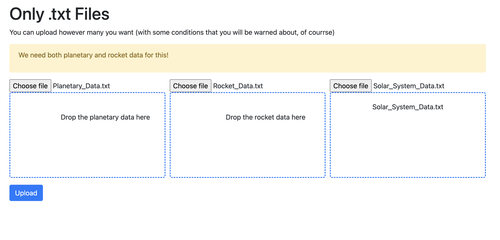
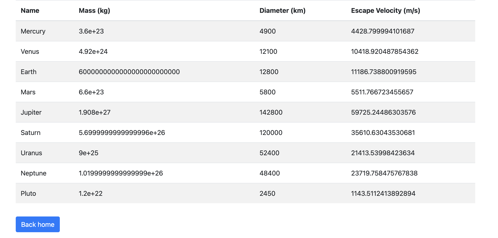
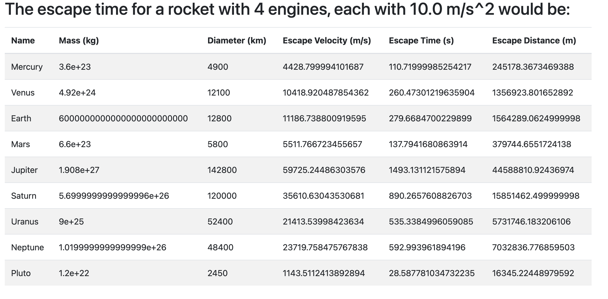
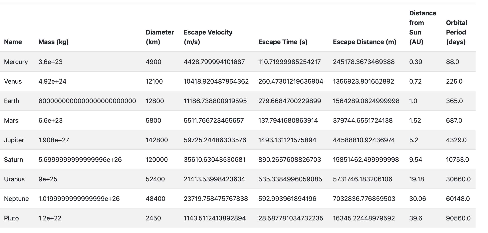
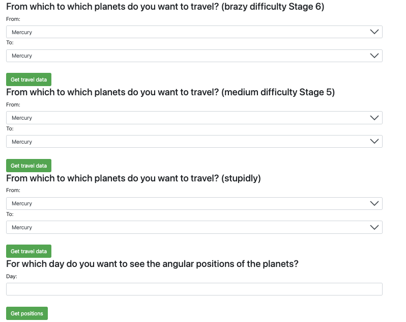
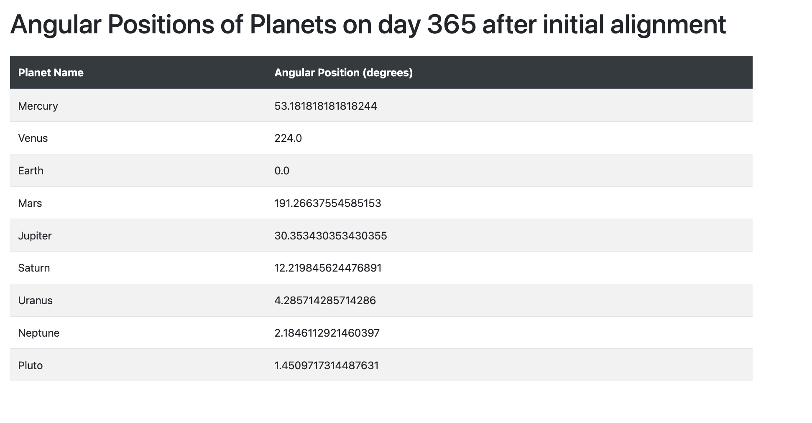

### THIS WAS AMAZING

#### running it:
first `cd` into the folder that contains this `README.md`, then
```bash
cd soft_challange
```
so `pwd` returns somehting like `/path/to/soft_challange/soft_challange`
then
```bash
pip install -r requirements.txt
flask --app . run
```
and now you can access your localhost server with the app.


<br>
<br>


##### In the homepage you can drag and drop files for each stage of the problem


<br>

##### The simplest way to use it is to just upload planetary data (computes stage 1)


#### Then you can also upload rocket data (computes stage 2)


#### Now the fun, does indeed begin. This is the output for uploading all three, planetary, rocket *and* solar system data

<br>

##### And just below are the options for all other stages:


#### I'll start with the last one: the angular positions of the planets after 365 days passing from them being aligned

